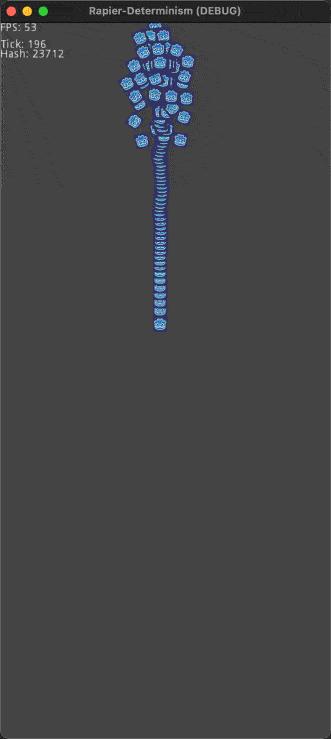
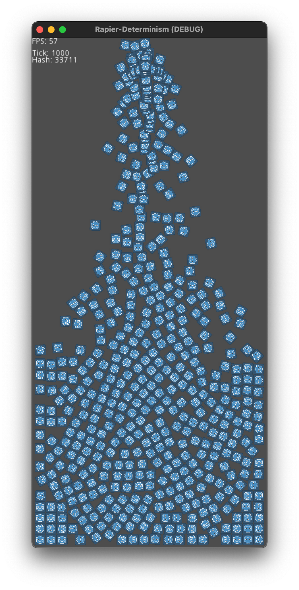

# Rapier Determinism

The purpose of this project is to have a demo of rigidbody physics based on [Rapier](https://rapier.rs) inside [Godot](https://godotengine.org) run on multiple platforms to check determinism.

**Note:** built it on your platform of choice and make sure it the resulting hash after 1000 ticks is **31227** and that it looks like this:

# Recording

# Final State

